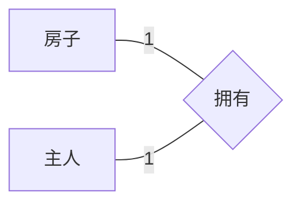
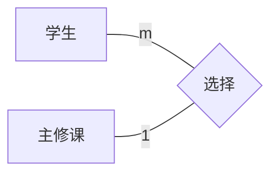
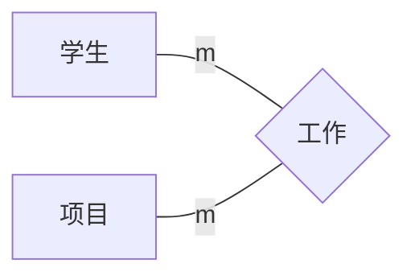
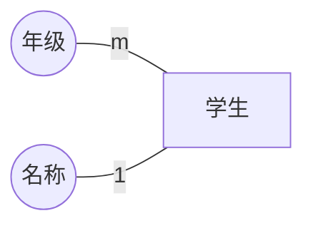

## 基本逻辑模型

### 逻辑模型分类

分层模型、网络模型、关系模式（以数据库表格形式保存数据，最受欢迎）

### 关系数据结构

下图描述 RDBMS 数据结构，数据库中每个表都有唯一的表名，通过表格定义数据之间的关系

| 用户ID | 姓名 | 邮箱                   | 注册日期   | 会员等级 | 余额(¥) | 状态 |
| -----: | ---- | ---------------------- | ---------- | -------- | -------: | ---- |
|   1001 | 张伟 | zhang.wei@example.com  | 2023-03-12 | 金卡     |   256.40 | 正常 |
|   1002 | 李娜 | li.na@example.com      | 2022-11-05 | 普通     |     0.00 | 冻结 |
|   1003 | 王强 | wang.qiang@example.com | 2024-01-18 | 白银     |  1035.90 | 正常 |
|   1004 | 陈晨 | chen.chen@example.com  | 2023-07-26 | 钻石     |    98.10 | 正常 |
|   1005 | 刘洋 | liu.yang@example.com   | 2021-09-02 | 黄金     |  5000.00 | 正常 |
|   1006 | 赵敏 | zhao.min@example.com   | 2020-05-21 | 普通     |    12.75 | 注销 |

其中

第一行是属性，第二行开始每行是元组。

#### 表示缺失信息

在表中表示为 `NULL，其不等于空格或零`

#### 表示关系

为了说明主键、外键与常见关系（1:N、N:M、复合主键），在“用户”表基础上补充几张表。下列表头用 [PK]/[FK] 标注主键/外键。

会员等级（被“用户.会员等级”引用）

| 等级名称 [PK] | 折扣 |
| ------------- | ---: |
| 钻石          | 0.80 |
| 黄金          | 0.85 |
| 白银          | 0.90 |
| 金卡          | 0.92 |
| 普通          | 1.00 |

订单（用户 与 订单：1:N）

| 订单ID [PK] | 用户ID [FK→用户.用户ID] | 下单时间         | 总金额(¥) |
| ----------: | -----------------------: | ---------------- | ---------: |
|       50001 |                     1001 | 2024-05-10 10:15 |     356.40 |
|       50002 |                     1003 | 2024-06-01 14:22 |      98.10 |

商品（被订单明细引用）

| 商品ID [PK] | 商品名     | 单价(¥) |
| ----------: | ---------- | -------: |
|       20001 | 咖啡豆 1kg |    89.00 |
|       20002 | 马克杯     |    29.90 |
|       20003 | 手冲壶     |   199.00 |

订单明细（订单 与 商品：N:M，经由复合主键的连接表）

| 订单ID [PK, FK→订单.订单ID] | 商品ID [PK, FK→商品.商品ID] | 数量 | 下单价(¥) |
| ---------------------------: | ---------------------------: | ---: | ---------: |
|                        50001 |                        20001 |    2 |      89.00 |
|                        50001 |                        20002 |    1 |      29.90 |
|                        50002 |                        20003 |    1 |     199.00 |

关系与约束摘要

- 用户.用户ID 为主键；邮箱可设为唯一键（候选键）以防重复。
- 用户.会员等级 为外键，引用 会员等级.等级名称（可选用编码替代名称以更规范）。
- 订单.订单ID 为主键；订单.用户ID 为外键，用户:订单 = 1:N。
- 商品.商品ID 为主键。
- 订单明细.(订单ID, 商品ID) 为复合主键；同时分别外键引用 订单 与 商品，订单:商品 = N:M。
- 参照完整性建议：
  - 删除用户时若存在订单：RESTRICT（禁止删除）；
  - 删除订单时同时删除其明细：ON DELETE CASCADE；
  - 更新外键列时与之相应的外键同步或限制：ON UPDATE CASCADE/RESTRICT（按业务选择）。
- 可选的 1:1 例：用户资料(Profile).用户ID 既是 [PK] 也是 [FK→用户.用户ID]，确保一位用户最多一条资料记录。

##### 一对一关系

##### 多对一关系

##### 多对多

## 创建 ER 图

### 实体（矩形）

记录数据的任何对象、地点、个人或活动，可分为实体类型和实体实例

在 ER 模型图示中，实体是在方框内命名和表示的

- 独立实体（强实体）

  - 拥有自身主键，存在不依赖其他实体
  - 示例：学生、课程、产品
  - 设计：优先选稳定主键，必要时使用代理键（自增/UUID）
- 依赖实体（弱实体）

  - 无完整主键，依赖“拥有实体”的主键与自身部分键共同标识
  - 约束：对拥有实体为全参与，常伴随级联删除；多用识别关系建模

举例:

### 联系（菱形）

- 定义：联系表示两个或多个实体之间基于业务规则的关联，是语义与约束的载体。
- 组成：参与实体、角色名、基数（1:1/1:N/M:N）、参与度（全部/部分）、联系属性（如时间、状态、数量、价格、顺序）。

### 属性（椭圆，键属性会加下划线）

用椭圆表示

### 步骤

- 确定实体
- 查找关系
- 确定关键属性
- 确定其他重要属性
- 绘制完整的 ER 图
- 审查 ER 图表
