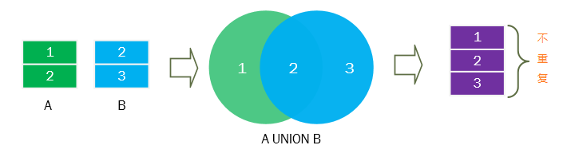
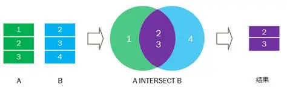
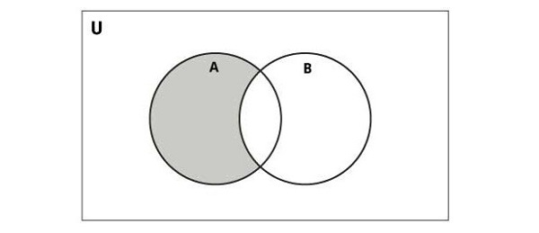

## 关系运算符

关系运算符将一个或两个关系作为输入，并产生一个新关系作为输出

### RESTRICT

限制操作符用于提取指定的元或行

### PROJECT

提取列

### PRODUCT

乘积运算符用于连接两个关系，使得第一个关系每个元组和第二个关系中的每个元组匹配

要实现产品兼容，两个表必须有共同的属性。

示例：两个关系 R(A, B) 与 S(C, D) 的笛卡尔乘积 R × S

关系 R

| A  | B  |
| -- | -- |
| a1 | b1 |
| a2 | b2 |

关系 S

| C  | D  |
| -- | -- |
| c1 | d1 |
| c2 | d2 |
| c3 | d3 |

R × S

| A  | B  | C  | D  |
| -- | -- | -- | -- |
| a1 | b1 | c1 | d1 |
| a1 | b1 | c2 | d2 |
| a1 | b1 | c3 | d3 |
| a2 | b2 | c1 | d1 |
| a2 | b2 | c2 | d2 |
| a2 | b2 | c3 | d3 |

行数 = |R| × |S| = 2 × 3 = 6

### UNION

从指定关系的一个或两个出现的元组建立一个关系，求并集

### INTERSECT

求交集

### DIFFERENCE

差分运算

### JOIN

连接运算符把两个关系按给定条件配对，满足条件的元组对连接成一行。记作 R ⋈cond S

常见类型
- 等值连接/内连接：cond 为相等条件
- 自然连接：对所有共同属性做等值连接，并去掉重复的列

示例（内连接，条件 R.B = S.B）

关系 R(A, B)

| A  | B  |
| -- | -- |
| a1 | b1 |
| a2 | b2 |
| a3 | b2 |

关系 S(B, C)

| B  | C  |
| -- | -- |
| b1 | c1 |
| b2 | c2 |
| b3 | c3 |

R ⋈ R.B = S.B S

| A  | B  | C  |
| -- | -- | -- |
| a1 | b1 | c1 |
| a2 | b2 | c2 |
| a3 | b2 | c2 |

自然连接 R ⋈ S（在共同属性 B 上连接，并去重重复列）结果与上表相同

提示：外连接（LEFT/RIGHT/FULL OUTER JOIN）会保留一侧不匹配的元组，用空值填充另一侧列

### DIVIDE

关系除法用于找出“与集合 S 中所有 Y 值都有关联的 X”。记作 R(X, Y) ÷ S(Y) = T(X)

示例

关系 R(Student, Course)

| Student | Course |
| ------- | ------ |
| s1      | c1     |
| s1      | c2     |
| s2      | c1     |
| s3      | c1     |
| s3      | c2     |
| s3      | c3     |

关系 S(Course)

| Course |
| ------ |
| c1     |
| c2     |

R ÷ S 的结果 T(Student)

| Student |
| ------- |
| s1      |
| s3      |

说明
- s1 选了 c1、c2，满足 S 中所有课程
- s3 选了 c1、c2、c3，也满足（包含 S 的超集仍满足）
- s2 只有 c1，不满足
- 若 S 含有 R 中不存在的课程，结果为空
- R 中多余的 Y 值不影响，只要包含 S 的全部 Y 即可
