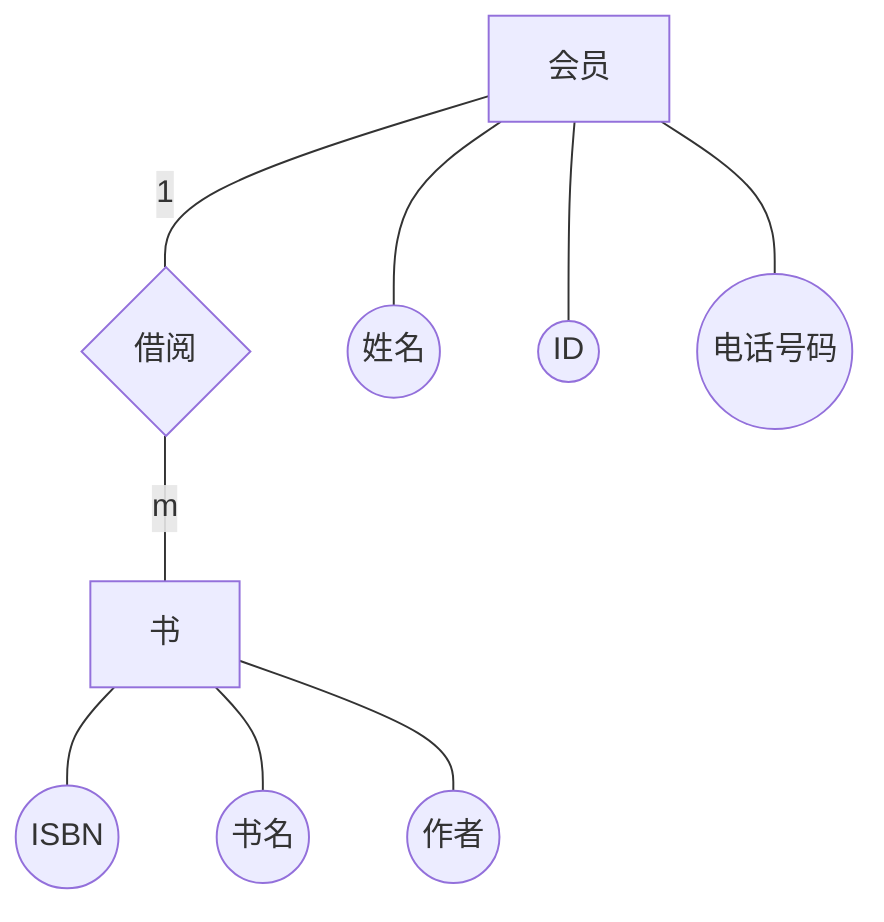
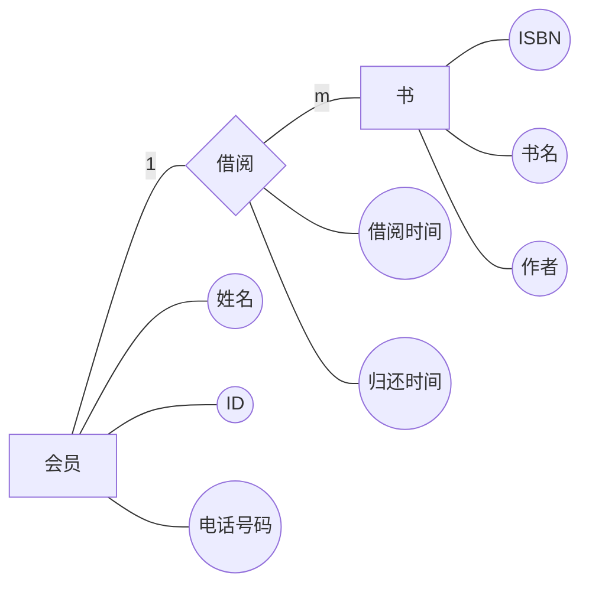
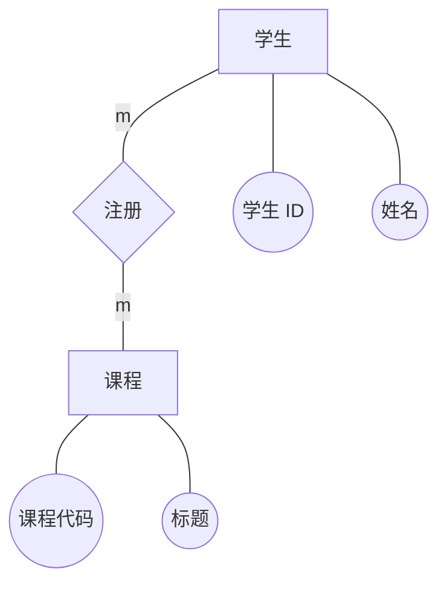

**Chapter
1: RDBMS Questions**

**Question
1: Basic Entities and Relationships**  **基本实体和关系**

**Scenario:** **场景**

A library wants to track its books and members. A member can borrow many books,
but a book can only be borrowed by one member at a time. A book is described by
its ISBN, title, and author. A member is described by their member ID, name,
and phone number.

一家图书馆希望跟踪其图书和会员。一个会员可以借阅很多本书，但一本书一次只能被一个会员借阅。一本书可以用 ISBN、书名和作者来描述。会员的描述包括会员 ID、姓名和电话号码

**Problem Statement:** **问题陈述**

Draw an ER Diagram for this scenario. Clearly show the entities, their
attributes, and the relationship between them, including its cardinality.

为该情景绘制 ER 图。清楚地显示实体、它们的属性和它们之间的关系，包括它们的心数

**Question 2: Attributes on Relationships** **关系属性**

**Scenario:** **场景**

Let's extend the library example. We now also want to record *when* a book
was borrowed and when it is due to be returned.

让我们扩展一下图书馆的示例。我们现在还想记录一本书的借阅时间和归还时间

Problem Statement:  **问题陈述**

Modify the ER Diagram from Question 1 to include this new information. Where
should these attributes (BorrowDate and DueDate) be placed? Update your diagram
accordingly.

修改问题 1 中的 ER 图以包含这些新信息。这些属性（BorrowDate 和 DueDate）应放在哪里？相应更新您的图表

**Question 3: Many-to-Many Relationship** **多对多关系**

**Scenario: 场景**

Now consider a university database. A student can enroll in many courses, and a course can
have many students enrolled in it. A student has a StudentID and Name. A course
has a CourseCode and Title.

现在考虑一下大学数据库。一个学生可以注册多门课程，一门课程可以有很多学生注册。一个学生有一个 StudentID 和姓名。一门课程有一个课程代码和标题

**Problem Statement:** **问题陈述**

Draw an ER Diagram for this scenario. Identify the correct cardinality and show
how you would handle the "many-to-many" relationship.

为这种情况绘制 ER 图。确定正确的心数，并说明如何处理 "多对多 "关系

**Questions 4:** Conversion of ER Diagram into Relational Database for Question 1 (Basic Library
1:M)

问题 4：将 ER 图转换为问题 1 的关系数据库（基础库 1:M）

| 会员姓名 | ID | 电话号码 | 书名 | ISBN | 作者 |
| -------- | -- | -------- | ---- | ---- | ---- |
|          |    |          |      |      |      |

**Questions 5:**
Conversion of ER Diagram into Relational Database for Question  2 (Library with Attributes on Relationship)

问题 5：将 ER 图转换为问题 2 的关系数据库（带有关系属性的库）

| 会员姓名 | ID | 电话号码 | 书名 | ISBN | 作者 | 借阅时间 | 归还时间 |
| -------- | -- | -------- | ---- | ---- | ---- | -------- | -------- |
|          |    |          |      |      |      |          |          |

**Questions 6:**
Conversion of ER Diagram into Relational Database for Question 3 (University
M:N Enrollment)

问题 6：将 ER 图转换为问题 3 的关系数据库（大学 M:N 招生情况）

学生

| 学生ID | 姓名 |
| ------ | ---- |
|        |      |

课程

| 课程代码 | 标题 |
| -------- | ---- |
|          |      |

注册

| 学生ID | 课程代码 |
| ------ | -------- |
|        |          |
